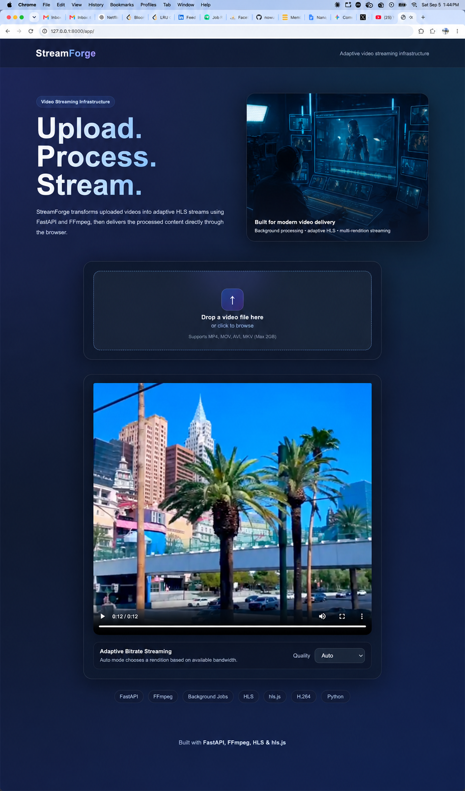

# StreamForge

StreamForge is a video streaming infrastructure project that transforms uploaded videos into adaptive HLS streams using an asynchronous processing pipeline.

The system accepts a video upload, queues the processing job through Redis and RQ, detects the source resolution with FFprobe, generates multiple HLS renditions with FFmpeg, creates a master playlist, and serves the result through a browser-based adaptive video player.

---
## Architecture


StreamForge implements a simplified production-style video streaming pipeline:

## Demo


```text
User Upload
    ↓
FastAPI
    ↓
Redis
    ↓
RQ Job Queue
    ↓
Background Worker
    ↓
FFprobe
    ↓
Source Resolution Detection
    ↓
FFmpeg
    ↓
HLS Renditions
    ↓
Master Playlist
    ↓
FastAPI Static Streaming
    ↓
hls.js Player


Features
Video upload through a responsive web interface
Drag-and-drop file selection
Asynchronous video processing with Redis and RQ
Persistent job state stored in Redis
Background workers separated from the API server
FFprobe-based source resolution detection
Automatic prevention of unnecessary video upscaling
FFmpeg-powered video transcoding
HLS video segmentation
Adaptive bitrate streaming
Multiple video renditions
Automatic HLS master playlist generation
Manual quality selection
Automatic quality adaptation using hls.js
Retry support for failed processing jobs
Queue wait time tracking
Per-rendition processing metrics
End-to-end processing metrics
Support for portrait and landscape video sources
Unique video and job IDs to prevent filename collisions
Adaptive Streaming

Depending on the uploaded source resolution, StreamForge automatically determines which renditions should be generated.

For example:

1080p source
    ↓
1080p
720p
480p
720p source
    ↓
720p
480p
480p source
    ↓
480p

This prevents unnecessary upscaling and reduces processing overhead.

HLS Pipeline

Each generated rendition contains:

playlist.m3u8
segment000.ts
segment001.ts
segment002.ts
...

StreamForge then creates a master HLS playlist similar to:

master.m3u8

which references every available rendition.

The browser player uses this playlist to automatically select and switch between available video qualities.

Background Job Processing

Video transcoding is intentionally separated from the FastAPI request lifecycle.

When a user uploads a video:

POST /upload

the API:

stores the uploaded video
creates a unique job
saves job state in Redis
places the processing task into the StreamForge RQ queue
immediately returns a job ID

The frontend then polls:

GET /jobs/{job_id}

until the job reaches:

completed

or:

failed

The RQ worker independently performs the FFprobe and FFmpeg processing.

Retry and Failure Recovery

Processing jobs use automatic retry support.

Failed worker jobs can be retried up to three times with increasing delays:

5 seconds
10 seconds
20 seconds

Worker exceptions are propagated back to RQ so failed tasks can be retried by the queue rather than silently terminating.

Processing Metrics

StreamForge records processing metrics for every job.

Example:

{
  "queue_wait_seconds": 0.025,
  "total_processing_seconds": 0.782,
  "rendition_processing_seconds": {
    "720p": 0.596,
    "480p": 0.437
  }
}

Metrics include:

queue wait time
total worker processing time
per-rendition processing time
job creation time
processing start time
completion time
Benchmark Results

A short-form video was processed across five repeated local benchmark runs.

Average queue wait:      0.025 s
Fastest queue wait:      0.021 s
Slowest queue wait:      0.030 s

Average processing:      0.782 s
Fastest processing:      0.751 s
Slowest processing:      0.837 s

Average end-to-end:      1.032 s
Fastest end-to-end:      1.023 s
Slowest end-to-end:      1.053 s

The benchmark measures the current local development environment and short test video rather than representing production-scale throughput.

Tech Stack
Backend
Python
FastAPI
Redis
RQ
FFmpeg
FFprobe
Uvicorn
Streaming
HLS
FFmpeg
hls.js
Frontend
HTML
CSS
JavaScript
Testing & Benchmarking
Python Requests
Custom benchmark script
Project Structure
streamforge/
│
├── backend/
│   │
│   ├── main.py
│   ├── worker.py
│   ├── benchmark.py
│   ├── requirements.txt
│   │
│   ├── uploads/
│   ├── processed/
│   │
│   └── static/
│       │
│       ├── index.html
│       │
│       └── images/
│           └── streaming-infrastructure.png
│
├── .gitignore
│
└── README.md
API
Health Check
GET /

Example:

{
  "message": "StreamForge API is running",
  "redis": "connected",
  "queue": "streamforge"
}
Upload Video
POST /upload

Example response:

{
  "message": "Video accepted for processing",
  "job_id": "job-id",
  "video_id": "video-id",
  "status": "queued"
}
Check Job Status
GET /jobs/{job_id}

Example completed job:

{
  "job_id": "job-id",
  "video_id": "video-id",
  "status": "completed",
  "source_resolution": "576x1024",
  "renditions": [
    "720p",
    "480p"
  ],
  "stream_url": "/stream/video-id/master.m3u8",
  "metrics": {
    "queue_wait_seconds": 0.025,
    "total_processing_seconds": 0.782
  }
}
Running StreamForge Locally
1. Clone the repository
git clone https://github.com/nowusu1/streamforge.git
cd streamforge/backend
2. Create a virtual environment
python3 -m venv venv
source venv/bin/activate
3. Install Python dependencies
pip install -r requirements.txt
4. Install Redis

On macOS:

brew install redis

Start Redis:

brew services start redis

Verify:

redis-cli ping

Expected output:

PONG
5. Install FFmpeg
brew install ffmpeg

Verify:

ffmpeg -version
6. Start the FastAPI server
uvicorn main:app --reload

The API will run at:

http://127.0.0.1:8000
7. Start the RQ worker

In a second terminal:

cd streamforge/backend
source venv/bin/activate
rq worker streamforge
8. Open StreamForge
http://127.0.0.1:8000/app/
Running the Benchmark

Place a short test video at:

backend/uploads/test-video.mp4

Then run:

python benchmark.py

The benchmark performs five repeated processing jobs and reports:

average queue wait
fastest and slowest queue wait
average processing duration
fastest and slowest processing duration
average end-to-end completion time
Engineering Decisions
Why Redis?

Redis provides persistent job metadata and allows the API and worker processes to communicate without depending on in-memory Python state.

Why RQ?

RQ provides lightweight asynchronous task processing while keeping CPU-intensive FFmpeg work out of the FastAPI request lifecycle.

Why HLS?

HLS separates video into independently retrievable segments and allows the browser to adapt playback quality according to available renditions.

Why FFprobe?

FFprobe allows StreamForge to inspect uploaded media before processing and avoid generating renditions larger than the original source.

Why Unique IDs?

Each upload receives unique video and job identifiers, preventing collisions between users uploading files with identical names.

Future Improvements

Potential extensions include:

multiple concurrent RQ workers
object storage such as Amazon S3
CDN-backed segment delivery
distributed worker deployment
authentication and user accounts
persistent database-backed video metadata
upload size validation
job expiration and storage cleanup
video thumbnails
streaming analytics
cache hit-rate monitoring
containerized deployment
Status

StreamForge currently supports the complete local workflow:

Upload
→ Queue
→ Process
→ Detect Resolution
→ Transcode
→ Segment
→ Generate HLS
→ Stream
→ Adapt Playback Quality
→ Track Metrics

The project demonstrates asynchronous media processing, background job orchestration, adaptive streaming, queue-based architecture, and system performance measurement.


